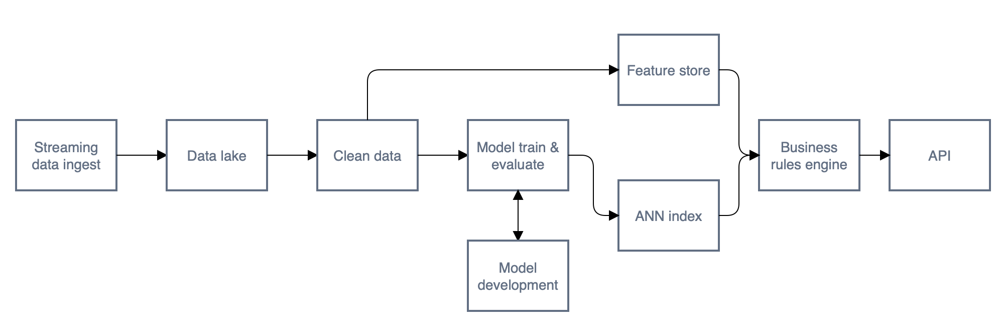

This repo is for the MLOps meetup.
I'm using a realistic system to illustrate a few examples of things that I really like from the MLOps community.

*This is not a good recommender system*.
It is for illustration of concepts, demonstration, and education.




# Instructions

## Setting up

```zsh
# convert the data to the right formats
python main.py initiate

python main.py training

python main.py make-indexes
```


## Serving

```
uvicorn main:app
```

## Adding a new day

```zsh
python main.py date-increment
```

at this stage, take a look at the pdf export to see if it looks right.
Then:


```zsh
python main.py training
python main.py make-indexes
```


----


## Dataset

Dataset is amazon reviews dataset for Musical Instruments.

https://jmcauley.ucsd.edu/data/amazon/

You might need to fill in a form saying why you want it.
